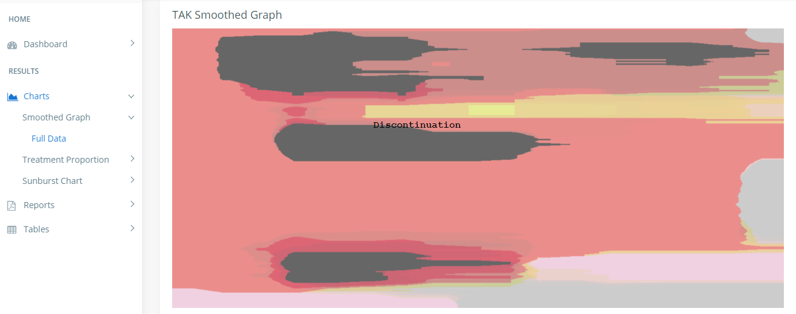

# TreatmentColor_onHover

This repo demonstrates how we can display Treatment names on Image Hover.
We first retrieve pixel value on Mouse position on the Canvas image.
then we compare these values to the predefined colours of the Treaments.

If the Colours values retrieved from the Canvas Container are different from those predefined (like in our case), we calculate the distance between the onMousePosition Colour 
and each of those predefined ones and we take the one with the minimum distance.

This is how the output looks like : 

